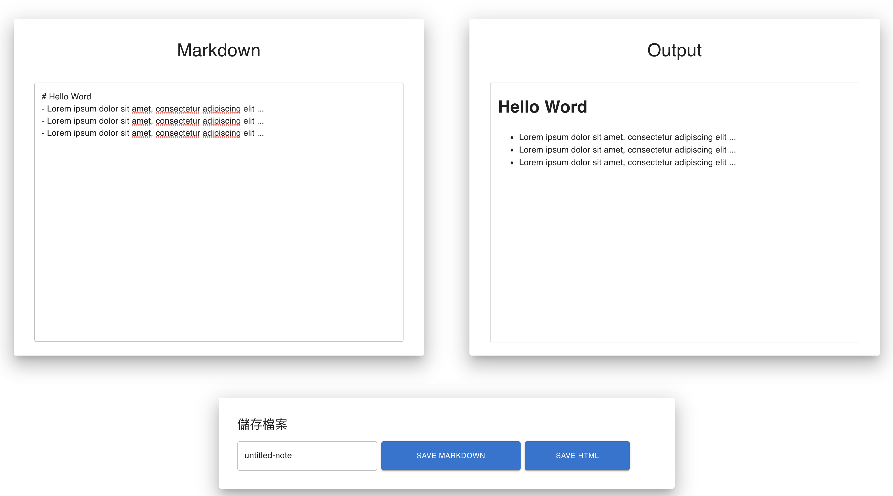

# Markdown Note Taking 

This project helps one to quickly jot down notes and download the rendered output.



Packages Used:

- `markdown-it`
- `file-saver`
- `@mui/material`

> The reason why I make this small project is that I want to know how HTML renders Markdown ~


# Usage

## 1. Download the package

```bash
npm i markdown-note
```
 
## 2. Contact

If you have any suggestion or question, please do not hesitate to email me at philcoke35@gmail.com
